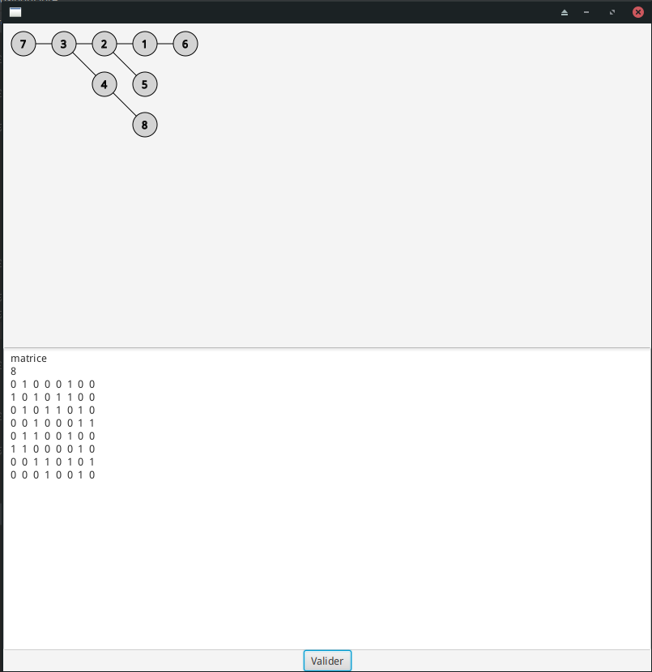

# Parcours en profondeur

Il s'agit d'une petite application en JAVA-FX permettant de réaliser un parcours en profondeur et de visualiser son arbre.

## Contexte :

La théorie des graphes est étudiée durant le second semestre de DUT Informatique, la consigne était de réaliser un algorithme de parcours en profondeur.

J'ai donc réalisé un algorithme récursif permettant d'effectuer un parcours. 
J'ai agrémenté celui-ci d'une IHM en java-FX pour rendre l'application plus agréable a utiliser.

## Réalisation :

Dans ce repository vous retrouverez le code de l'application. 
Pour l'utiliser, il suffit de fournir la matrice d'adjacence de votre graphe et sa taille, et le parcours sera effectué. (java 1.8)

## Contributeur :
- https://github.com/Duffscs
